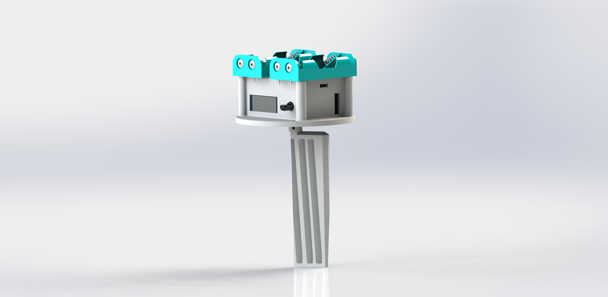
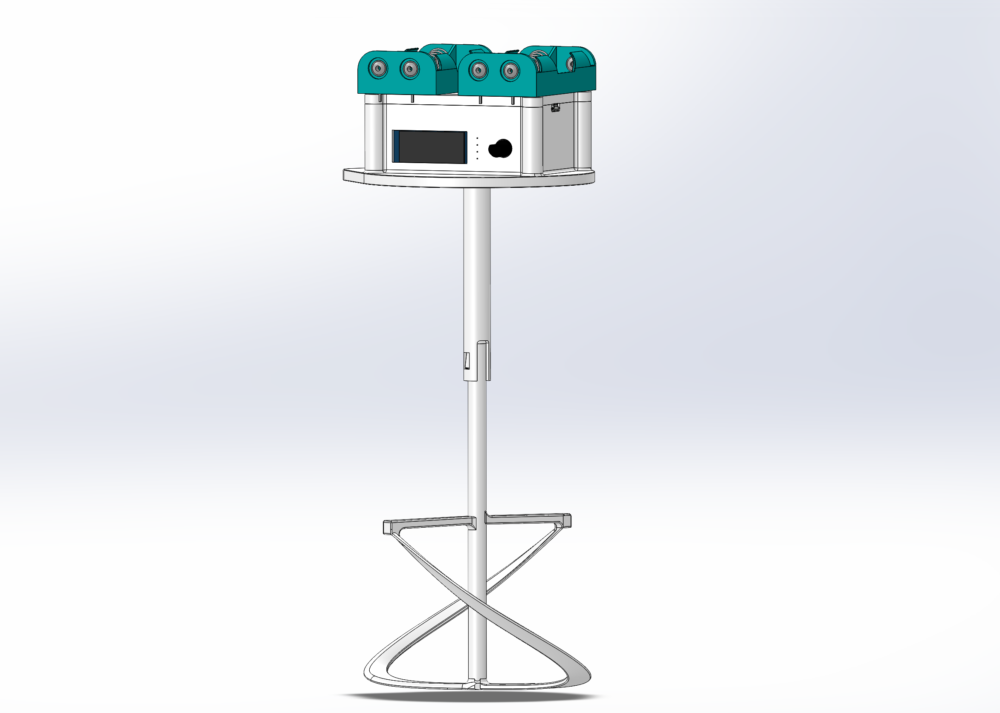

## Fish Tank Solution Mixer

A mini-project purpose built for a vat of calcium carbonate solution. The device fits onto the lid of the vat, where a mixing head dips into the solution. A time interval can be set in between mixing cycles.

### Usage Instructions
  
Power: 4.5-6V, 4x AA Batteries or 5V 0.500A DC
  USB power from a common phone charger would suffice.
  
A switch can be used to toggle between each power source, but cannot be used at the same time. If the battery drops below 4.5V, it may not turn on and will need to be recharged. Stall current (when the motor is stuck) shouldn't exceed 400mA, but might risk burning out if it does. The battery circuitry lacks back current protection, so please take care when inserting batteries. 

Upon turning on, a prompt to set the interval time will appear on the display. Turn the knob to increase or decrease the time, then click the knob to save that time. The default is 60 minutes. The next prompt will be the mixing time, default 3 minutes of contiuous rotation. Interval and mix settings or **not** saved when the device is turned off and will need to be set again if it does.

Once the settings are inputted, the device will enter a mix cycle right away. You may use this time to confirm the device's proper operation by observing the rotating mixer head. The screen should also have turned off to save power. After the the mix cycle ends, it will go into sleep mode to wait out the interval.

### The Problem

An alkaline solution of calcium carbonate is used for the operation of a tropical fish tank. However, the solution becomes saturated with extra particulates settling at the bottom. 

### Design Constraints

The effectiveness of mixing is the most important aspect of this problem. The mixer should be able to effectively mix the settled particles from the bottom of the vat, in a way that nearly homogenously distributes it within the rest of the solution. A secondary requirements of the device is the displacement of the mixing head and the material used for it. Too much displacement of liquid in the vat will reduce the efficiency of the Fish Tank system. As for the mixing head's material, it must not degrade or react within the solution. A tertiary consideration was the power consumption of the device. Ideally, the device should barely use any power between untervals, and should use power efficienty when mixing.

  
### Initial Approaches

The device will have 3 main aspects: Controller, Mixer, and Power. The first revision of the mixing head was meant to simply induce a vortex within the vat, but the particles at the bottom would not be lifted up efficiently.

</img>

A fully analog system using a 555 timer was considered, but would lmit flexibility and accuracy of adjusting the time interval. In addition, it would limit future functionality if the device were to be integrated into a larger Fish Tank management system.

The production of the mixing head and enclosure was to be done with an FDM 3D printer, with Polylactic Acid (PLA) as the material. However, this would not be fit for the fish tank's environment. PLA is brittle and degrades when exposed to water for long periods. In addition, calcium deposit build up may be difficult to remove and clean. 

To power the device, having only a set of 4 AA Batteries to power it would have been sufficient, but may not have been enough due to the required amount of power to mix the solution.

### Code
  
The code for the device can be seen on the repository:
  
https://github.com/ViktorVektor/DavidTankMIxer.git
  
  
### 03/09/2021
  
</img>

Progressing from the previous approaches, the controller was upgraded into an Arduino Nano, underclocked at 8Mhz to lower power usage. This will allow for flexibility in the devices function if additional features like bluetooth or IoT functionality is added. This controller can also vary the movement of the motor to better mix the solution.
  
The device's enclosure and mixer will be FDM 3D Printed using PET-G, a common material used in water bottles and food containers. It was desireable for its inactivity with the solution, higher strength, and its tendency to deform instead of fracture at failure. It can also be submerged for long period of time without degradation. The mixing head was moved closer to the bottom, and was modeled to resemble paint mixer heads. The shaft was also extended from the enclosure. In the middle, the shaft was split into two components to allow for ease of transport. 
  
To adjust the time interval, a rotary encoder and an OLED display were added. Rotating the encoder would adjust the interval by the minute, which would then be displayed. A transistor would be used to switch the display on or off in order to save power between mix cycles.
  
To power the device, a combination of battery power and USB power. If a plug is accessible, USB power can be used. Otherwise, battery power can be used but at a reduced lifetime.
  
  
### 05/09/2021
 

 
Electronics
	
Will be focusing less on battery power as the Arduino Mini boards won't arrive until the end of the month
Switched to 360 motor, can control direction but no speed
Using Arduino nano in low power mode and removing LED
Servo switch removed, diodes removed because voltage drop was too significant
Improved functionality of switching between USB and battery power
	When switched to battery, will only use battery and turns off otherwise.
	Battery power predicted to last about 5 days
Added capacitor to smoothen voltage spike when starting up servo to spin
	
Updated schematic (please excuse the messy layout)

  
Software
	
Cleaned up the rest of the code and uploaded to repo, pretty much complete
Added new function for adjusting mixing time, default 3 minutes
Added new function for displaying the saved interval and mixing time
Had an issue with the 360 sg90, setting a single pulse width seems to stall it if it isn't switched to another pulse width
- Solved by switching to another pulse width every few milliseconds
		
 Hardware
	
Will most likely use perf board on hand to complete the project
Gathered necessary components, looks like there is enough
LED of the Arduino will need to be desoldered

Testing of mixing coupling and head begins

Original coupling shaft was changed, the flexing lock breaks too easily when trying to remove the mixing head
- Will instead extend the internal hex socket to hold the head through friction
	
Mixing head v1 and v2 were not effective as particles gathered at the bottom center of the container, induced a vortex in the liquid that forced the particles down. A third mixer was developed (as seen in this log's image). Though it mixed well by lifting up particles from the bottom of the tank, the shaft had been too fragile for repeated use.
