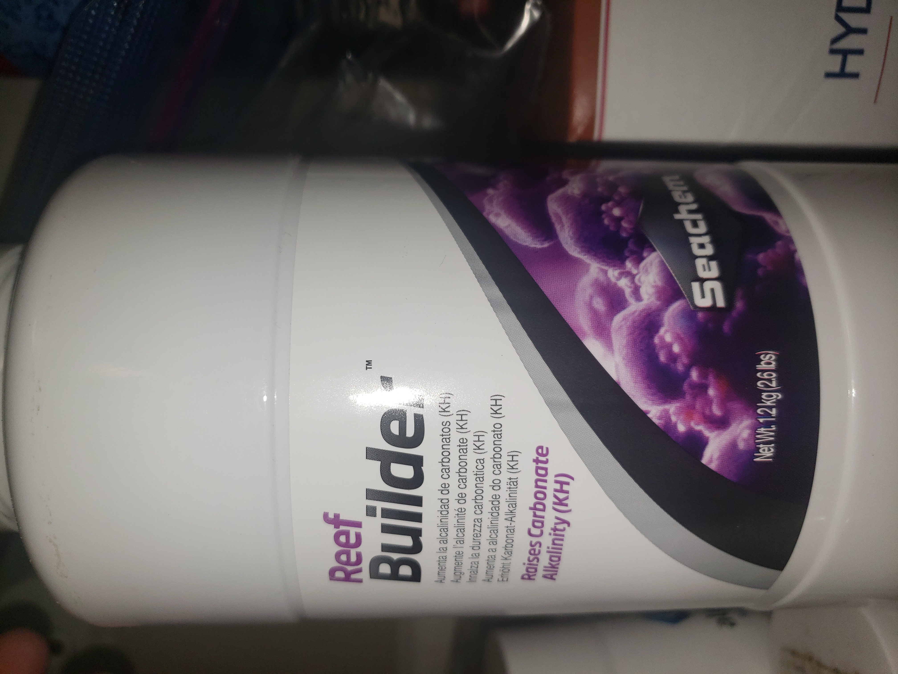
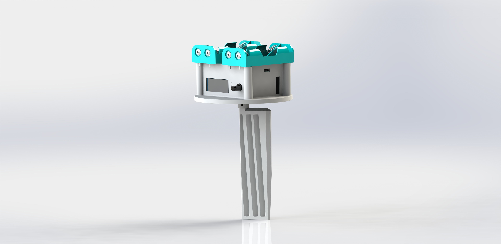
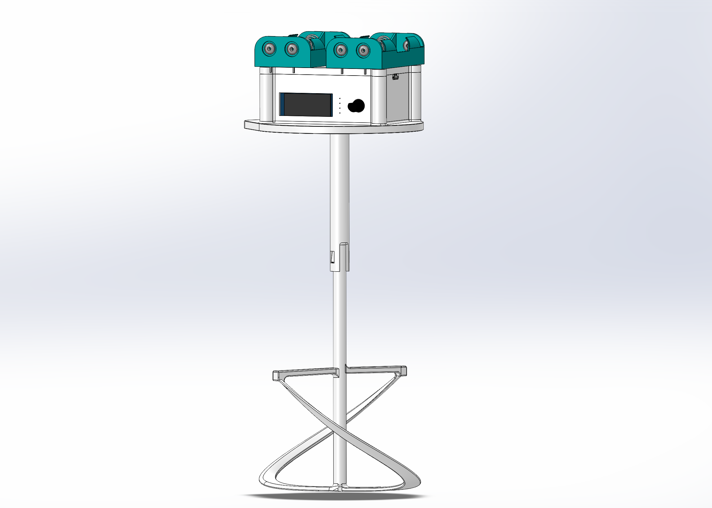

## Fish Tank Solution Mixer

A mini-project purpose built for a vat of calcium carbonate solution. The device fits onto the lid of the vat, where a mixing head dips into the solution. A time interval can be set in between mixing cycles.

### The Problem

An alkaline solution of calcium carbonate is used for the operation of a tropical fish tank. However, the solution becomes saturated with extra particulates settling at the bottom. 

### Design Constraints

The effectiveness of mixing is the most important aspect of this problem. The mixer should be able to effectively mix the settled particles from the bottom of the vat, in a way that nearly homogenously distributes it within the rest of the solution. A secondary requirements of the device is the displacement of the mixing head and the material used for it. Too much displacement of liquid in the vat will reduce the efficiency of the Fish Tank system. As for the mixing head's material, it must not degrade or react within the solution. A tertiary consideration was the power consumption of the device. Ideally, the device should barely use any power between untervals, and should use power efficienty when mixing.

<image>
<table><tr>
  <td> 

 </td>
  <td> 

 </td>
</tr><table>
</image>
  
### Initial Approaches

The device will have 3 main aspects: Controller, Mixer, and Power. The first revision of the mixing head was meant to simply induce a vortex within the vat, but the particles at the bottom would not be lifted up efficiently.

A fully analog system using a 555 timer was considered, but would lmit flexibility and accuracy of adjusting the time interval. In addition, it would limit future functionality if the device were to be integrated into a larger Fish Tank management system.

The production of the mixing head and enclosure was to be done with an FDM 3D printer, with Polylactic Acid (PLA) as the material. However, this would not be fit for the fish tank's environment. PLA is brittle and degrades when exposed to water for long periods. In addition, calcium deposit build up may be difficult to remove and clean. 

To power the device, having only a set of 4 AA Batteries to power it would have been sufficient, but may not have been enough due to the required amount of power to mix the solution.

### Current Revision
  

Progressing from the previous approaches, the controller was upgraded into an Arduino Nano, underclocked at 8Mhz to lower power usage. This will allow for flexibility in the devices function if additional features like bluetooth or IoT functionality is added. This controller can also vary the movement of the motor to better mix the solution.
  
The device's enclosure and mixer will be FDM 3D Printed using PET-G, a common material used in water bottles and food containers. It was desireable for its inactivity with the solution, higher strength, and its tendency to deform instead of fracture at failure. It can also be submerged for long period of time without degradation. The mixing head was moved closer to the bottom, and was modeled to resemble paint mixer heads. The shaft was also extended from the enclosure. In the middle, the shaft was split into two components to allow for ease of transport. 
  
To adjust the time interval, a rotary encoder and an OLED display were added. Rotating the encoder would adjust the interval by the minute, which would then be displayed. A transistor would be used to switch the display on or off in order to save power between mix cycles.
  
To power the device, a combination of battery power and USB power. If a plug is accessible, USB power can be used. Otherwise, battery power can be used but at a reduced lifetime. Note, both cannot be used at the same time because there is no switching functionality. 
  
### Action Items
  
 As of Septermber 2021, The enclosrue and electronics of the device have been finalized. The mixing head and coupling still need to be tested for their efficiency and strength. The device is planned to be shipped out by the 3rd week of September.
  
### Code
  
The code for the device can be seen here:
  
...
#include <SPI.h>
#include <Wire.h>
#include <Servo.h>
#include <Adafruit_GFX.h>
#include <Adafruit_SSD1306.h>
#include <LowPower.h>

#define SERVO_PWM 5
#define MAX_PULSE_WIDTH 1250
#define MIN_PULSE_WIDTH 250

#define CYCLE_LENGTH 30  // 30 operations for a minute of mixing
#define MIX_DURATION 3 // 3 minutes of mixing

Servo motor;

#define DISPLAY_SWITCH 3

#define SCREEN_WIDTH 128 // OLED display width, in pixels
#define SCREEN_HEIGHT 32 // OLED display height, in pixels
#define OLED_RESET     4 // Reset pin # (or -1 if sharing Arduino reset pin)
#define SCREEN_ADDRESS 0x3C ///< See datasheet for Address; 0x3D for 128x64, 0x3C for 128x32
Adafruit_SSD1306 display(SCREEN_WIDTH, SCREEN_HEIGHT, &Wire, OLED_RESET);

#define NUMFLAKES 10

#define LOGO_HEIGHT   16
#define LOGO_WIDTH    16

#define CLK A1
#define DT A0
#define SW 2

int interval = 0;
int multiplier = 1;
int cycles = CYCLE_LENGTH * MIX_DURATION;

int currentStateCLK;
int lastStateCLK;
unsigned long lastButtonPress = 0;

int pos = 0;

// // For a button interrupt
//void wakeUp()
//{
//  //Handler for pin interrupt
//  detachInterrupt(0);
//}

void setup() {
  // Clock Speed from 16Mhz to 8Mhz
  CLKPR = 0x80;
  CLKPR = 0x01;
  
  //Serial.begin(4800);

  pinMode(SERVO_PWM, OUTPUT);
  pinMode(DISPLAY_SWITCH, OUTPUT);
  pinMode(CLK,INPUT_PULLUP);
  pinMode(DT,INPUT_PULLUP);
  pinMode(SW, INPUT_PULLUP);
  
  digitalWrite(DISPLAY_SWITCH, HIGH);

  //set servo to correct position at start
  motor.attach(SERVO_PWM, MIN_PULSE_WIDTH, MAX_PULSE_WIDTH);
  motor.writeMicroseconds(250);
  delay(300);
  motor.detach();
  
  // Read the initial state of CLK of encoder
  lastStateCLK = digitalRead(CLK);

  //attachInterrupt(0, wakeUp, INPUT);
  //delay(1000);

  // SSD1306_SWITCHCAPVCC = generate display voltage from 3.3V internally
  if(!display.begin(SSD1306_SWITCHCAPVCC, SCREEN_ADDRESS)) {
    //Serial.println(F("SSD1306 allocation failed"));
    for(;;); // Don't proceed, loop forever
  }

  //rotate the screen since orienteation in the enclosure is upside down
  display.setRotation(2);
  
  // clear the buffer, setup the first text 
  display.clearDisplay();
  display.setTextSize(1);
  display.setTextColor(WHITE);
  display.setCursor(10,16);
  display.display();
  delay(50);

  // time setting function
  setInterval();

  // begind going into sleep mode
  digitalWrite(DISPLAY_SWITCH, LOW);

  // requrested interval time in terms of 4s chunks (so 1 minute is 15x multiplier), 
  //minus 4s offset, interval between mixing considers mixing time of 3 minutes.
  multiplier = ((interval - MIX_DURATION) * 15) - 1;

  // default interval of 1 minute rest
  if(interval <= 1)
  {
    multiplier = 15; 
  }
}
  
void loop() {
  
  // servo mixing function
  spinCycle();

  for(int looper = 0; looper < multiplier; looper++)
    LowPower.powerDown(SLEEP_4S, ADC_OFF, BOD_OFF);  

}

void spinCycle()
{
//  digitalWrite(SERVO_SWITCH, HIGH);
  motor.attach(SERVO_PWM, MIN_PULSE_WIDTH, MAX_PULSE_WIDTH);

  // Using a modified 360-degree continuous SG90 Servo
  // Due to some electrical quirk, the servo stops spinning when not changing the pulse width.
  for(int y = 0; y < cycles; y++)
  {
    for(int x = 0; x < 25; x += 1)
    {
      motor.writeMicroseconds(MAX_PULSE_WIDTH);
      delay(20);
      motor.writeMicroseconds(MIN_PULSE_WIDTH);
      delay(20);  
    }
    //motor.writeMicroseconds(500);
    
  }
//  // Code block for using a normal 180-degree SG90 Servo
//  //1 minute of mixing
//  for(int y = 0; y < cycles; y++)
//  {
//    // 2 second  operation
//    for (int x = MIN_PULSE_WIDTH; x < MAX_PULSE_WIDTH; x+=50)
//    {
//      motor.writeMicroseconds(x);
//      delay(25);
//    }
//    for (int x = MAX_PULSE_WIDTH; x > MIN_PULSE_WIDTH; x-=50)
//    {
//      motor.writeMicroseconds(x);
//      delay(25);
//    }
//  }
  motor.detach();
}

void setInterval()
{
  display.clearDisplay();
  display.print("Rotate to Adjust ->");
  display.display();
  boolean selection = true;

  while(selection)
  {
    // Read the current state of CLK
    currentStateCLK = digitalRead(CLK);
    
    // If last and current state of CLK are different, then pulse occurred
    // React to only 1 state change to avoid double count
    if (currentStateCLK != lastStateCLK  && currentStateCLK == 1){
  
      // If the DT state is different than the CLK state then
      // the encoder is rotating CCW so decrement
      if (digitalRead(DT) != currentStateCLK) {
        if (interval > 0) // handling negative values
        {
          interval --;
        }
        else
        {
          interval = 0;
        }
        
      } else {
        // Encoder is rotating CW so increment
        interval ++;
      }

      // display the current time setting
      display.clearDisplay();
      display.setCursor(10,2);
      display.setTextSize(1);
      display.print("Time Interval: ");
      display.setCursor(0,15);
      display.setTextSize(2);
      display.print(interval);
      display.print("m");
      display.display();
    }
    
  
    // Remember last CLK state for encoder
    lastStateCLK = currentStateCLK;
  
    // Read the button state
    int btnState = digitalRead(SW);
  
    //If we detect LOW signal, button is pressed
    if (btnState == LOW) {
      //if 50ms have passed since last LOW pulse, it means that the
      //button has been pressed, released and pressed again
      if (millis() - lastButtonPress > 50) {

        //close the time selection loop
        selection = false;
        
        display.clearDisplay();
        display.setCursor(0,15);
        display.setTextSize(2);
        display.print("Time Set!");
        display.display();
        delay(1000);

        display.clearDisplay();
        display.setCursor(0,15);
        display.setTextSize(2);
        display.print("Sleeping");
        display.display();
        delay(1000);
        
      }
  
      // Remember last button press event
      lastButtonPress = millis();
    }
  
    // Put in a slight delay to help debounce the reading
    delay(1);
  }

}
  ...
