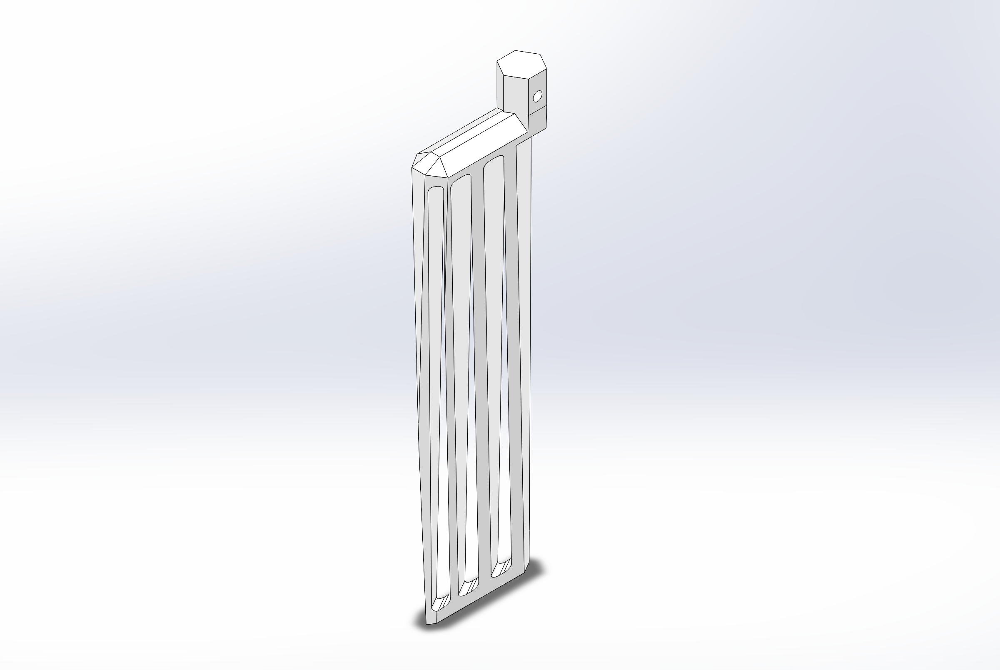

## Fish Tank Solution Mixer

A mini-project purpose built for a vat of calcium carbonate solution. The device fits onto the lid of the vat, where a mixing head dips into the solution. A time interval can be set in between mixing cycles.

### The Problem

An alkaline solution of calcium carbonate is used for the operation of a tropical fish tank. However, the solution becomes saturated with extra particulates settling at the bottom. 

### Design Considerations

The effectiveness of mixing is the most important aspect of this problem. The mixer should be able to effectively mix the settled particles from the bottom of the vat, in a way that nearly homogenously distributes it within the rest of the solution. A secondary requirements of the device is the displacement of the mixing head and the material used for it. Too much displacement of liquid in the vat will reduce the efficiency of the Fish Tank system. As for the mixing head's material, it must not degrade or react within the solution. A tertiary consideration was the power consumption of the device. Ideally, the device should barely use any power between untervals, and should use power efficienty when mixing.

<table><tr>
  <td>  </td>
  <td>  </td>
</tr><table>
### Initial Approaches

The first revision of the mixing head was meant to simply induce a vortex within the vat, but the particles at the bottom would not be lifted up efficiently.

A fully analog system using a 555 timer was considered, but would lmit flexibility and accuracy of adjusting the time interval. In addition, it would limit future functionality if the device were to be integrated into a larger Fish Tank management system.

The production of the mixing head and enclosure was to be done with an FDM 3D printer, with Polylactic Acid (PLA) as the material. However, this would not be fit for the fish tank's environment. PLA is brittle and degrades when exposed to water for long periods. In addition, calcium deposit build up may be difficult to remove and clean. 

To power the device, having only a set of 4 AA Batteries to power it would have been sufficient, but may not have been enough due to the required amount of power to mix the solution.

### Current Revision

